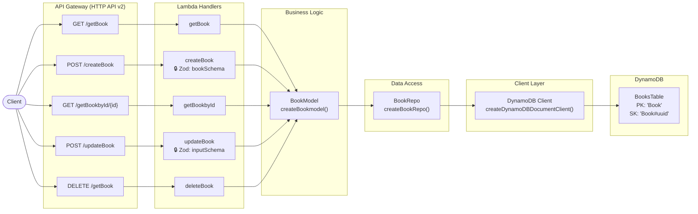

# Architecture Diagram

```mermaid
flowchart LR
    Client([Client])

    subgraph APIGateway["API Gateway (HTTP API v2)"]
        R1["GET /getBook"]
        R2["POST /createBook"]
        R3["GET /getBookbyId/{id}"]
        R4["POST /updateBook"]
        R5["DELETE /getBook"]
    end

    subgraph Handlers["Lambda Handlers"]
        H1["getBook"]
        H2["createBook\n🔒 Zod: bookSchema"]
        H3["getBookbyId"]
        H4["updateBook\n🔒 Zod: inputSchema"]
        H5["deleteBook"]
    end

    subgraph Model["Business Logic"]
        BM["BookModel\ncreateBookmodel()"]
    end

    subgraph Repository["Data Access"]
        BR["BookRepo\ncreateBookRepo()"]
    end

    subgraph Client_Layer["Client Layer"]
        DC["DynamoDB Client\ncreateDynamoDBDocumentClient()"]
    end

    subgraph DynamoDB["DynamoDB"]
        BT["BooksTable\nPK: 'Book'\nSK: 'Book#uuid'"]
    end

    Client --> R1 & R2 & R3 & R4 & R5

    R1 --> H1
    R2 --> H2
    R3 --> H3
    R4 --> H4
    R5 --> H5

    H1 & H2 & H3 & H4 & H5 --> BM
    BM --> BR
    BR --> DC
    DC --> BT
```
